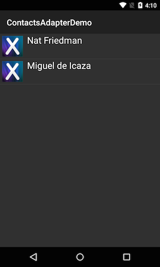

<a name="Recipe" class="injected"></a>


# Recipe

 [ ](Images/CustomAdapter.png)

-  Create a new Xamarin.Android application named ContactsAdapterDemo.
-  Open AndroidManifest.xml (in the Properties folder) and set the READ_CONTACTS permission.
-  Add the following markup to Main.axml (located in the Resources&gt;layout folder):


```
<?xml version="1.0" encoding="utf-8"?>
<LinearLayout xmlns:android="http://schemas.android.com/apk/res/android"
        android:orientation="vertical"
        android:layout_width="fill_parent"
        android:layout_height="fill_parent">
    <ListView android:id="@+id/ContactsListView"
            android:layout_width="fill_parent"
            android:layout_height="fill_parent" />
</LinearLayout>
```

-  In MainActivity.cs replace the `OnCreate` method with the code below. We’ll implement `ContactsAdapter` shortly.


```
protected override void OnCreate (Bundle bundle)
{
    base.OnCreate (bundle);
    SetContentView (Resource.Layout.Main);
    var contactsAdapter = new ContactsAdapter (this);
    var contactsListView = FindViewById<ListView> (Resource.Id.ContactsListView);
    contactsListView.Adapter = contactsAdapter;
}
```

-  Add a file named ContactListItem.xml under Resources &gt; layout with the following markup.


```
<?xml version="1.0" encoding="UTF-8"?>
<LinearLayout xmlns:android="http://schemas.android.com/apk/res/android"
        android:layout_width="fill_parent"
        android:layout_height="fill_parent">
    <ImageView
        android:id="@+id/ContactImage"
        android:layout_width="50dp"
        android:layout_height="50dp"
        android:layout_margin="5dp" />
    <TextView
        android:id="@+id/ContactName"
        android:layout_width="wrap_content"
        android:layout_height="wrap_content"
        android:textAppearance="?android:attr/textAppearanceLarge"
        android:layout_marginLeft="5dp" />
</LinearLayout>
```

-  Add a new C# class named ContactsAdapter to the project and set its base class to `BaseAdapter`.

-  Add the following usings:

```
using System;
using System.Collections.Generic;
using Android.App;
using Android.Content;
using Android.Provider;
using Android.Views;
using Android.Widget;
```
-
  Add the following code to `ContactsAdaper` to retrieve contacts:


```
public class ContactsAdapter : BaseAdapter
{
    List<Contact> _contactList;
    Activity _activity;

    public ContactsAdapter (Activity activity)
        {
            _activity = activity;
            FillContacts ();
        }

    void FillContacts ()
    {
        var uri = ContactsContract.Contacts.ContentUri;

        string[] projection = {
                ContactsContract.Contacts.InterfaceConsts.Id,
                ContactsContract.Contacts.InterfaceConsts.DisplayName,
                ContactsContract.Contacts.InterfaceConsts.PhotoId
            };

        var cursor = _activity.ManagedQuery (uri, projection, null,
            null, null);

        _contactList = new List<Contact> ();

        if (cursor.MoveToFirst ()) {
            do {
                _contactList.Add (new Contact{
                         Id = cursor.GetLong (
                cursor.GetColumnIndex (projection [0])),
                         DisplayName = cursor.GetString (
                cursor.GetColumnIndex (projection [1])),
                         PhotoId = cursor.GetString (
                cursor.GetColumnIndex (projection [2]))
                     });
            } while (cursor.MoveToNext());
        }
    }

    class Contact
    {
        public long Id { get; set; }
        public string DisplayName{ get; set; }
        public string PhotoId { get; set; }
    }
}
```

-  Implement the abstract methods from `BaseAdapter`:


```
public override int Count {
    get { return _contactList.Count; }
}

public override Java.Lang.Object GetItem (int position) {
    // could wrap a Contact in a Java.Lang.Object
    // to return it here if needed
    return null;
}

public override long GetItemId (int position) {
    return _contactList [position].Id;
}

public override View GetView (int position, View convertView, ViewGroup parent)
{
    var view = convertView ?? _activity.LayoutInflater.Inflate (
        Resource.Layout.ContactListItem, parent, false);
    var contactName = view.FindViewById<TextView> (Resource.Id.ContactName);
    var contactImage = view.FindViewById<ImageView> (Resource.Id.ContactImage);
    contactName.Text = _contactList [position].DisplayName;

    if (_contactList [position].PhotoId == null) {
        contactImage = view.FindViewById<ImageView> (Resource.Id.ContactImage);
        contactImage.SetImageResource (Resource.Drawable.contactImage);
    }  else {
        var contactUri = ContentUris.WithAppendedId (
            ContactsContract.Contacts.ContentUri, _contactList [position].Id);
        var contactPhotoUri = Android.Net.Uri.WithAppendedPath (contactUri,
            Contacts.Photos.ContentDirectory);
        contactImage.SetImageURI (contactPhotoUri);
    }
    return view;
}
```

-  Add a placeholder contact image to one of the drawable folders inside Resources named  `ContactImage.png`. This image is used for contacts that have no preview image included. The sample project for this recipe includes an image you can use.
-  Running the application displays contacts as shown at the beginning of this recipe. Note that if you are using a device that has no contacts, nothing will be displayed. Use the built-in contact manager to add contacts.


 <a name="Additional_Information" class="injected"></a>


# Additional Information

The `GetView` method implemented in a BaseAdapter subclass returns the view for
each object in the list. By reusing previously created view instances, available
in the `convertView` argument passed to `GetView`, efficient scrolling performance
can be achieved.

