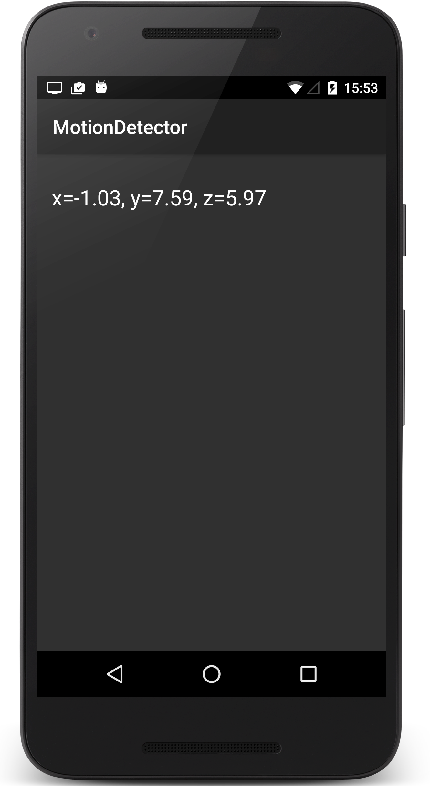

This recipe will show how to use the accelerometer to measure a device’s motion in three dimensions.

 

# Recipe

1.  Create a new Xamarin.Android application named `MotionDetector`.

2.  Edit **Main.axml** so that it contains a single `TextView`:

        <LinearLayout xmlns:android="http://schemas.android.com/apk/res/android"
            android:orientation="vertical"
            android:layout_width="fill_parent"
            android:layout_height="fill_parent">
            <TextView
                android:id="@+id/accelerometer_text"
                android:layout_width="fill_parent"
                android:textAppearance="?android:attr/textAppearanceLarge"
                android:layout_height="wrap_content"
                android:text="TEXT"
                android:layout_marginLeft="15dp"
                android:layout_marginRight="15dp"
                android:layout_marginTop="30dp" />
        </LinearLayout>

3. Add some instance variables to **Activity1.cs**:

        static readonly object _syncLock = new object();
        SensorManager _sensorManager;
        TextView _sensorTextView;

4. Have **Activity1** implement the interface `ISensorEventListener` and implement the methods for the interface:

        public void OnAccuracyChanged(Sensor sensor, SensorStatus accuracy)
        {
            // We don't want to do anything here.
        }
        
        public void OnSensorChanged(SensorEvent e)
        {
            lock (_syncLock)
            {
                _sensorTextView.Text = string.Format("x={0:f}, y={1:f}, z={2:f}", e.Values[0], e.Values[1], e.Values[2]);
            }
        }

5. Change `OnCreate` and get a reference to the `SensorManager`:

        protected override void OnCreate(Bundle bundle)
        {
            base.OnCreate(bundle);
            SetContentView(Resource.Layout.Main);
            _sensorManager = (SensorManager) GetSystemService(Context.SensorService);
            _sensorTextView = FindViewById<TextView>(Resource.Id.accelerometer_text);
        }

6. Override `OnResume` so that the application will listen to updates from the accelerometer. The Activity will begin listening to updates from the accelerometer:

        protected override void OnResume()
        {
            base.OnResume();
            _sensorManager.RegisterListener(this,
                                            _sensorManager.GetDefaultSensor(SensorType.Accelerometer),
                                            SensorDelay.Ui);
        }

7. Override `OnPause` so that the Activity will stop listening to the accelerometer when the application is not active. This is done to reduce the drain on the battery and to preserve battery life:

        protected override void OnPause()
        {
            base.OnPause();
            _sensorManager.UnregisterListener(this);
        }

8. Run the application on a device. As the device is moved around, the accelerometer values will display on the screen.

## Additional Information

The accelerometer returns values that describe the changes in acceleration along the three axes of the coordinate system measured in m/s2. These axes are show in the diagram below:

 
