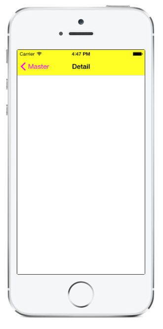

There are two properties in the UINavigationBar class which will allow you to change colors. `TintColor` will change the color of the back indicator image, button titles and button Images. `barTintColor` will change the color of the bar itself. This recipe shows how to change the the tint and background colors of a navigation bar.

 <a name="Recipe" class="injected"></a>


# Recipe

To change the color of the navigation bar items, set the TintColor property of the
UIViewController’s NavigationBar property:

```
this.NavigationController.NavigationBar.TintColor = UIColor.Magenta;
```

To change the color of the navigation bar, set the barTintColor property of the
UIViewController’s NavigationBar property:

```
this.NavigationController.NavigationBar.BarTintColor = UIColor.Yellow;
```

The Image below shows the updated Navigation Bar:

 [ ](Images/NavBarImage.png)

To reset the color to its default, set this value to null:

```
this.NavigationController.NavigationBar.TintColor = null;
this.NavigationController.NavigationBar.BarTintColor = null;
```

 <a name="Additional_Information" class="injected"></a>


# Additional Information

You can style all the navigation bars in your application at once by styling the
static UINavigationBar class with these lines:

```
UINavigationBar.Appearance.barTintColor = UIColor.Blue;
UINavigationBar.Appearance.TintColor = UIColor.White;
```

