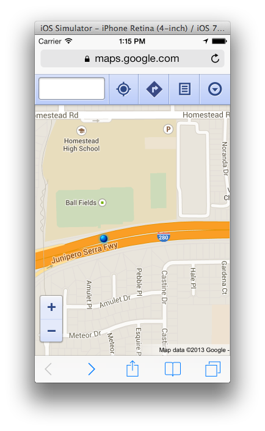

[ ](Images/01.png)

# Recipe

1. The Significant Location Changes API requires the **CoreLocation** library, so we'll start by adding the using directive:

    ```
    using CoreLocation;
    ```

2. Next, create an instance of a `CLLocationManager`. The location manager listens to the system's location service:

    ```
    var LocMgr = new CLLocationManager();
    ```

3. Starting with iOS 8, applications must call `requestWhenInUseAuthorization` on `CLLocationManager` to gain access to the user's application. If the app hasn't been granted permission before, the user will be prompted to allow or deny access.

    ```
      LocMgr.requestAlwaysAuthorization(); //to access user's location in the background
      LocMgr.requestWhenInUseAuthorization(); //to access user's location when the app is in use.
    ```

4.  In addition to explicitly requesting access to the user's location, you must add two keys to the **Info.plist** file, by opening **Info.plist** and selecting **Source**:

    * **NSLocationWhenInUseUsageDescription** - A description of why your app wants to access the user's location in the foreground.
    * **NSLocationAlwaysInUsageDescription** - A description of why your app wants to access the user's location in the background.

5. Check if location services are enabled on the device and for your application. If location data is available, start listening for changes with the `StartMonitoringSignificantLocationChanges`

    ```
    if (CLLocationManager.LocationServicesEnabled) {
        LocMgr.StartMonitoringSignificantLocationChanges ();
      } else {
        Console.WriteLine ("Location services not enabled, please enable this in your Settings");
      }
    ```

6. When the service receives a location update, the system will wake the application in the background to handle the location changed event. To run your code, subscribe to the location service's `LocationsUpdated` event, and add a custom handler:

    ```
    LocMgr.LocationsUpdated += (o, e) =&gt; Console.WriteLine ("Location change received");
    ```

    > ℹ️ **Note**: The application has approximately 10 seconds after the `LocationsUpdated` event fires to run code in the background. If you want to run a process that takes more than 10 seconds, wrap it in a [Background Task](https://developer.xamarin.com/guides/cross-platform/application_fundamentals/backgrounding/part_3_ios_backgrounding_techniques/ios_backgrounding_with_tasks).

7. Call the following method to stop monitoring location:

    ```
    LocMgr.StopMonitoringSignificantLocationChanges ();
    ```

8. The application output should resemble the following:


To test significant location changes in the iOS simulator, refer to the [Test Location Changes in Simulator recipe](Recipes/ios/multitasking/test_location_changes_in_simulator).

