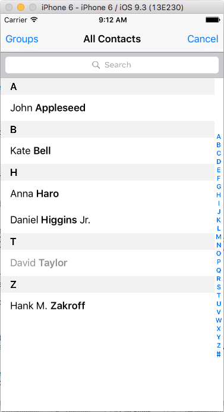
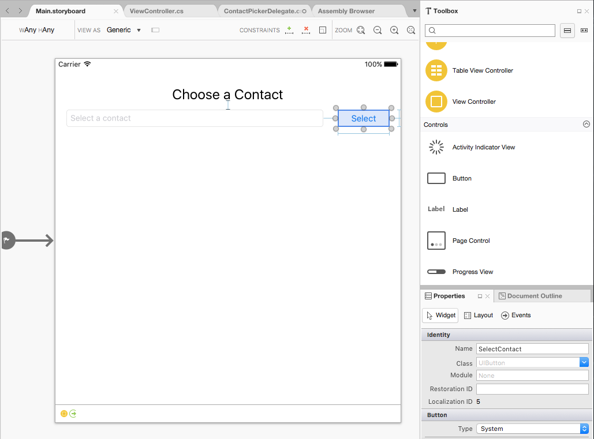

<a name="Recipe" class="injected"></a>
# Recipe

 [ ](Images/Choose01.png) 
 
The Contact Picker View Controller (`CNContactPickerViewController`) manages the standard Contact Picker View that allows the user to select a Contact or a Contact property from the user's Contact Database. The user can select one or more contact (based on its usage) and the Contact Picker View Controller does not prompt for permission before displaying the picker. 

To use the Contact Picker View Controller to select a Contact or Contact Property do the following:

<a name="Add-a-Contact-Picker-Delegate" class="injected"></a>
## Add a Contact Picker Delegate

First, add a new class to the project named `ContactPickerDelegate` and make it look like the following:

```
using System;
using Contacts;
using ContactsUI;

namespace ContactAccess
{
	public class ContactPickerDelegate : CNContactPickerDelegate
	{
		#region Constructors
		public ContactPickerDelegate ()
		{
		}

		public ContactPickerDelegate (IntPtr handle) : base (handle)
		{
		}
		#endregion

		#region Override Methods
		public override void ContactPickerDidCancel (CNContactPickerViewController picker)
		{
			// Raise the selection canceled event
			RaiseSelectionCanceled ();
		}

		public override void DidSelectContact (CNContactPickerViewController picker, CNContact contact)
		{
			// Raise the contact selected event
			RaiseContactSelected (contact);
		}

		public override void DidSelectContactProperty (CNContactPickerViewController picker, CNContactProperty contactProperty)
		{
			// Raise the contact property selected event
			RaiseContactPropertySelected (contactProperty);
		}
		#endregion

		#region Events
		public delegate void SelectionCanceledDelegate ();
		public event SelectionCanceledDelegate SelectionCanceled;

		internal void RaiseSelectionCanceled ()
		{
			if (this.SelectionCanceled != null) this.SelectionCanceled ();
		}

		public delegate void ContactSelectedDelegate (CNContact contact);
		public event ContactSelectedDelegate ContactSelected;

		internal void RaiseContactSelected (CNContact contact)
		{
			if (this.ContactSelected != null) this.ContactSelected (contact);
		}

		public delegate void ContactPropertySelectedDelegate (CNContactProperty property);
		public event ContactPropertySelectedDelegate ContactPropertySelected;

		internal void RaiseContactPropertySelected (CNContactProperty property)
		{
			if (this.ContactPropertySelected != null) this.ContactPropertySelected (property);
		}
		#endregion
	}
}
```

This class provides three events for working with the Contact Picker View: `SelectionCanceled`, `ContactSelected` and `ContactPropertySelected`.

<a name="Design-your-UI" class="injected"></a>
## Design your UI

Design your app's User Interface that will be used to call the Contact Picker View. For example, a `UIButton` to call the picker and `UITextField` to display the results:

[ ](Images/Choose02.png)

<a name="Present-the-Picker" class="injected"></a>
## Present the Picker

Call the Contact Picker View Controller when the user clicks the button. For example:

```
using System;
using Foundation;
using Contacts;
using ContactsUI;
using UIKit;

namespace ContactAccess
{
	public partial class ViewController : UIViewController
	{
		protected ViewController (IntPtr handle) : base (handle)
		{
			
		}

		public override void ViewDidLoad ()
		{
			base.ViewDidLoad ();
		}

		partial void SelectContact_TouchUpInside (UIButton sender)
		{
			// Create a new picker
			var picker = new CNContactPickerViewController ();

			// Select property to pick
			picker.DisplayedPropertyKeys = new NSString [] { CNContactKey.EmailAddresses };
			picker.PredicateForEnablingContact = NSPredicate.FromFormat ("emailAddresses.@count > 0");
			picker.PredicateForSelectionOfContact = NSPredicate.FromFormat ("emailAddresses.@count == 1");

			// Respond to selection
			var pickerDelegate = new ContactPickerDelegate ();
			picker.Delegate = pickerDelegate;

			pickerDelegate.SelectionCanceled += () => {
				SelectedContact.Text = "";
			};

			pickerDelegate.ContactSelected += (contact) => {
				SelectedContact.Text = string.Format ("{0} {1}", contact.GivenName, contact.FamilyName);
			};

			pickerDelegate.ContactPropertySelected += (property) => {
				SelectedContact.Text = property.Value.ToString ();
			};

			// Display picker
			PresentViewController (picker, true, null);
		}
	}
}
```

Let's look at this code in detail:

1. First, it creates a new instance of the `CNContactPickerViewController`.
2. Then it decides what contact properties to return and which contacts can be selected using the `DisplayedPropertyKeys`, `PredicateForEnablingContact` and `PredicateForSelectionOfContact` properties of the picker.
3. Next, it creates a new instance of the custom Contact Picker Delegate added above and attaches it to the picker.
4. Then it responds to the `SelectionCanceled`, `ContactSelected` and `ContactPropertySelected` events by updated the app's UI.
5. Finally it displays the picker to the user `PresentViewController (picker, true, null)`.

<a name="Additional_Information" class="injected"></a>
# Additional Information

For more information, please see our [Contacts and ContactUI](https://developer.xamarin.com/guides/ios/platform_features/introduction_to_ios9/contacts/) documentation.

