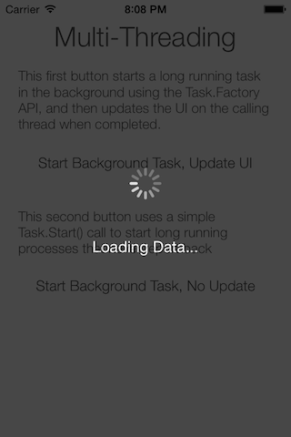

# Recipe

A “Loading...” message while performing a network operation (or other
long-running task) looks like this:

To display the overlay, follow these steps:

1. Add this `LoadingOverlay` class to your project:

		using System;
		using UIKit;
		using CoreGraphics;

		public class LoadingOverlay : UIView {
			// control declarations
			UIActivityIndicatorView activitySpinner;
			UILabel loadingLabel;

			public LoadingOverlay (CGRect frame) : base (frame)
			{
				// configurable bits
				BackgroundColor = UIColor.Black;
				Alpha = 0.75f;
				AutoresizingMask = UIViewAutoresizing.All;

				nfloat labelHeight = 22;
				nfloat labelWidth = Frame.Width - 20;

				// derive the center x and y
				nfloat centerX = Frame.Width / 2;
				nfloat centerY = Frame.Height / 2;

				// create the activity spinner, center it horizontall and put it 5 points above center x
				activitySpinner = new UIActivityIndicatorView(UIActivityIndicatorViewStyle.WhiteLarge);
				activitySpinner.Frame = new CGRect (
					centerX - (activitySpinner.Frame.Width / 2) ,
					centerY - activitySpinner.Frame.Height - 20 ,
					activitySpinner.Frame.Width,
					activitySpinner.Frame.Height);
				activitySpinner.AutoresizingMask = UIViewAutoresizing.All;
				AddSubview (activitySpinner);
				activitySpinner.StartAnimating ();

				// create and configure the "Loading Data" label
				loadingLabel = new UILabel(new CGRect (
					centerX - (labelWidth / 2),
					centerY + 20 ,
					labelWidth ,
					labelHeight
					));
				loadingLabel.BackgroundColor = UIColor.Clear;
				loadingLabel.TextColor = UIColor.White;
				loadingLabel.Text = "Loading Data...";
				loadingLabel.TextAlignment = UITextAlignment.Center;
				loadingLabel.AutoresizingMask = UIViewAutoresizing.All;
				AddSubview (loadingLabel);
			}

			/// 

			/// Fades out the control and then removes it from the super view
			/// 

			public void Hide ()
			{
				UIView.Animate (
					0.5, // duration
					() => { Alpha = 0; },
					() => { RemoveFromSuperview(); }
				);
			}
		}

2. Create a field in your class to store a reference to the overlay
control:

		LoadingOverlay loadPop;

3. Before starting a long-running task, create the overlay and add it to the current view:

		var bounds = UIScreen.MainScreen.Bounds;

		// show the loading overlay on the UI thread using the correct orientation sizing
		loadPop = new LoadingOverlay (bounds); // using field from step 2
		View.Add (loadPop);

4. When the long-running task is complete, call `Hide()`:

		loadPop.Hide ();

Download the [DisplayLoadingMessage sample code](https://github.com/xamarin/Recipes/tree/master/ios/standard_controls/popovers/DisplayLoadingMessage) to see a complete working example.

