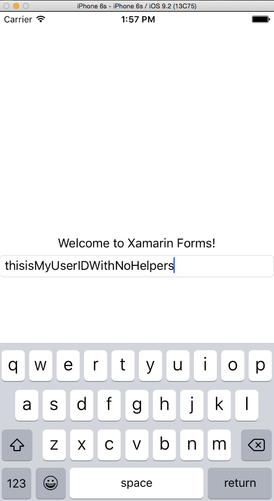

# Overview

Entry fields that are used to input some data types, such as a User ID, can
be frustrating to use on iOS when the operating system attempts to capitalize
or correct spelling.

This behavior can be disabled with a custom renderer for the
[`Entry`](https://developer.xamarin.com/api/type/Xamarin.Forms.Entry/) control.

## Common Xamarin.Forms code

Create a subclass of `Entry` - in this case we do not need to implement any
additional properties or methods on the class. Adding this subclass in the
common code does not affect the rendering in any way (until a custom renderer is added).

```
/// <summary>
/// Required for Custom Renderer to target just this Type
/// </summary>
public class NoHelperEntry : Entry
{
}
```

In the code building the user interface for a page, create an instance of the subclass:

```
var myEntry = new NoHelperEntry {
  Keyboard = Keyboard.Text,
};
```

If the user interface is defined in XAML then a custom `xmlns` must be declared that references the common code assembly, and then the custom prefix used when declaring the new control:

```
<ContentPage xmlns="http://xamarin.com/schemas/2014/forms"
             xmlns:x="http://schemas.microsoft.com/winfx/2009/xaml"
             xmlns:local="clr-namespace:YOUR_APP_NAMESPACE;assembly=YOUR_APP_ASSEMBLY"
             x:Class="YOUR_APP_NAMESPACE.SomeItemPage">
    <local:NoHelperEntry x:Name="myEntry" />
</ContentPage>
```


## iOS application project

In the iOS project implement a custom renderer as shown (remember to update the namespace to reflect your project):

```
using System;
using Xamarin.Forms.Platform.iOS;
using Xamarin.Forms;
using UIKit;
using CoreGraphics;
using YOUR_APP_NAMESPACE.iOS;
using YOUR_APP_NAMESPACE;

[assembly: ExportRenderer(typeof(NoHelperEntry), typeof(NoHelperEntryRenderer))]
namespace YOUR_APP_NAMESPACE.iOS
{
	public class NoHelperEntryRenderer : EntryRenderer
	{
		protected override void OnElementChanged (ElementChangedEventArgs<Entry> e)
		{
			base.OnElementChanged (e);
			if (Control != null) {
				Control.SpellCheckingType = UITextSpellCheckingType.No;				// No Spellchecking
				Control.AutocorrectionType = UITextAutocorrectionType.No;			// No Autocorrection
				Control.AutocapitalizationType = UITextAutocapitalizationType.None;	// No Autocapitalization
			}
		}
	}
}
```

The custom entry control is shown below, note that no spelling corrections,
auto-capitalization or other suggestions appear to impede the user:



If you are using an `EntryCell` in a list or table, refer to [this related forum post](https://forums.xamarin.com/discussion/comment/83751/#Comment_83751)
that shows how to create a cell renderer and use `NoHelperEntry`.


## Android and Windows platforms

These platforms don't interfer with the user's typing as agressively as iOS,
so no additional implementation is required to get a reasonable data-entry experience.
Of course it is still possible to create `NoHelperEntryRenderer` classes for
the Android or Windows platforms, following the above principles but using
Android and Windows APIs for configuring data entry options.

# Summary

This recipe shows how to add a toolbar as an `InputAccessoryView` on iOS so that you can dismiss the keyboard via a **Done** button in Xamarin.Forms.

## Credits

Matthew Regul wrote this custom renderer.

